Analytics E1
================

## Libraries

``` r
library(tidyverse)
library(scales)
library(widyr)
library(tidymetrics)
```

install.packages(“remotes”)

remotes::install\_github(“ramnathv/tidymetrics”)

## Load Data

``` r
big_mac <- readr::read_csv('https://raw.githubusercontent.com/rfordatascience/tidytuesday/master/data/2020/2020-12-22/big-mac.csv')
```

## EDA

``` r
big_mac <- big_mac %>%
  rename(country = name) %>%
  add_count(country, name = "country_total") %>%
  filter(country_total == max(country_total)) %>%
  arrange(country, date)
```

``` r
big_mac%>%
  ggplot(aes(date,local_price,color=country))+
  geom_line(show.legend = F)+
  facet_wrap(~country, scales = 'free_y')+
  theme(axis.text.x = element_text(angle = 90, vjust = 0.5, hjust=1))
```

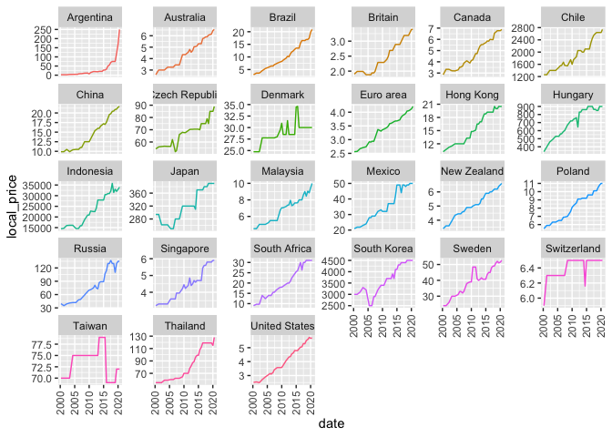<!-- -->

Organizando la data para validar las variaciones

``` r
big_mac %>%
  mutate(country = fct_reorder(country, local_price, function(.) last(.) / first(.))) %>%
  ggplot(aes(date, local_price, color = country)) +
  geom_line(show.legend = F) +
  expand_limits(y = 0) +
  facet_wrap(~ country, scales = "free_y")
```

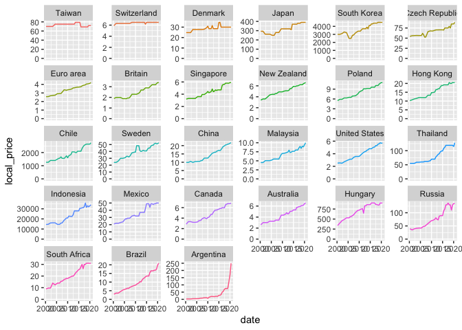<!-- -->

Calculando la variación de los precios

$$
inflation = \\frac{\\mbox{last local price}}{\\mbox{first local price}}
$$

``` r
big_mac %>%
  group_by(country) %>%
  summarize(big_mac_inflation = last(local_price) / first(local_price)) %>%
  arrange(desc(big_mac_inflation)) %>%
  mutate(country = fct_reorder(country, big_mac_inflation)) %>%
  ggplot(aes(big_mac_inflation, country,fill=big_mac_inflation)) +
  geom_col()+
  scale_fill_gradient(low = "pink",high = "red")+
  labs(fill="Inflación")
```

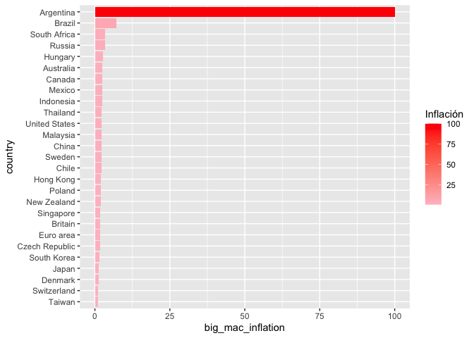<!-- -->

Convirtiendo todo a dolares

``` r
big_mac %>%
  group_by(date) %>%
  mutate(usd_price = local_price[iso_a3 == "USA"],
         us_gdp = gdp_dollar[iso_a3 == "USA"]) %>%
  ungroup() %>%
  mutate(big_mac_ex = local_price / usd_price)%>%
  select(date, iso_a3, country, local_price, dollar_ex, usd_price, big_mac_ex, usd_raw, gdp_dollar, us_gdp, usd_adjusted)
```

    ## # A tibble: 891 x 11
    ##    date       iso_a3 country local_price dollar_ex usd_price big_mac_ex  usd_raw
    ##    <date>     <chr>  <chr>         <dbl>     <dbl>     <dbl>      <dbl>    <dbl>
    ##  1 2000-04-01 ARG    Argent…        2.5       1         2.51      0.996 -0.00398
    ##  2 2001-04-01 ARG    Argent…        2.5       1         2.54      0.984 -0.0158 
    ##  3 2002-04-01 ARG    Argent…        2.5       3.13      2.49      1.00  -0.679  
    ##  4 2003-04-01 ARG    Argent…        4.1       2.88      2.71      1.51  -0.475  
    ##  5 2004-05-01 ARG    Argent…        4.36      2.95      2.9       1.50  -0.490  
    ##  6 2005-06-01 ARG    Argent…        4.75      2.90      3.06      1.55  -0.464  
    ##  7 2006-01-01 ARG    Argent…        4.75      3.06      3.15      1.51  -0.508  
    ##  8 2006-05-01 ARG    Argent…        7         3.06      3.1       2.26  -0.261  
    ##  9 2007-01-01 ARG    Argent…        8.25      3.09      3.22      2.56  -0.170  
    ## 10 2007-06-01 ARG    Argent…        8.25      3.09      3.41      2.42  -0.217  
    ## # … with 881 more rows, and 3 more variables: gdp_dollar <dbl>, us_gdp <dbl>,
    ## #   usd_adjusted <dbl>

``` r
big_mac %>%
  group_by(date) %>%
  mutate(usd_price = local_price[iso_a3 == "USA"],
         us_gdp = gdp_dollar[iso_a3 == "USA"]) %>%
  ungroup() %>%
  filter(country == "Mexico",
         !is.na(gdp_dollar)) %>%
  mutate(price_from_usd = usd_price * dollar_ex) %>%
  ggplot(aes(date, local_price)) +
  geom_line(aes(color = "Price (in local currency)")) +
  geom_line(aes(y = price_from_usd, color = "Price from USD"))
```

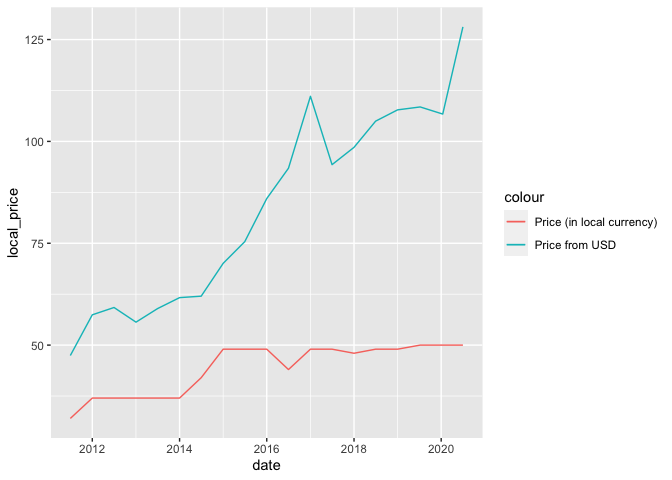<!-- -->

Ajustes del PIB al indice

``` r
big_mac %>%
  filter(country != "United States") %>%
  select(date, country, local_price, dollar_ex, usd_raw, gdp_dollar, usd_adjusted) %>%
  filter(!is.na(gdp_dollar)) %>%
  mutate(country = fct_reorder(country, usd_raw)) %>%
  ggplot(aes(date, usd_adjusted)) +
  geom_line() +
  geom_hline(color = "red", lty = 2, yintercept = 0) +
  expand_limits(y = 0) +
  facet_wrap(~ country) +
  theme(axis.text.x = element_text(angle = 90, hjust = 1))
```

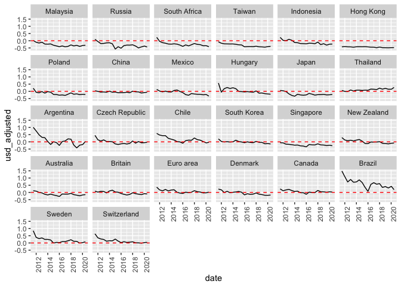<!-- -->

``` r
library(ggrepel)
big_mac %>%
  filter(date == max(date)) %>%
  ggplot(aes(gdp_dollar, usd_raw)) +
  geom_point() +
  geom_smooth(method = "lm") +
  geom_text_repel(aes(label = country)) +
  labs(x = "PIB per capita en Dolares",
       y = "Big Max Index relativo")
```

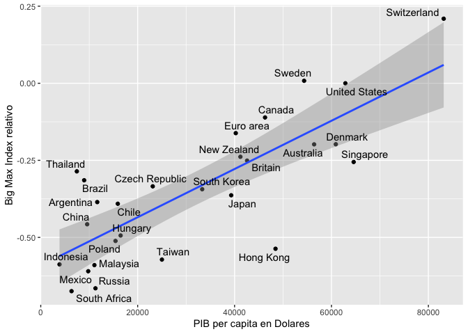<!-- -->

``` r
big_mac %>%
  group_by(date) %>%
  mutate(usd_price = local_price[iso_a3 == "USA"],
         us_gdp = gdp_dollar[iso_a3 == "USA"])%>%
  ungroup() %>%
  filter(!is.na(us_gdp))%>%
  mutate(country=fct_reorder(country,usd_adjusted))%>%
  ggplot(aes(usd_adjusted,country,fill=country))+
  geom_boxplot(show.legend = F)
```

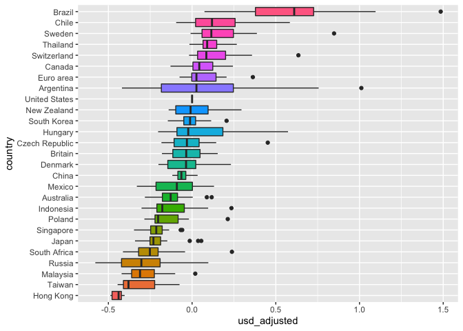<!-- -->

``` r
big_mac %>%
  group_by(date) %>%
  mutate(usd_price = local_price[iso_a3 == "USA"],
         us_gdp = gdp_dollar[iso_a3 == "USA"]) %>%
  ungroup() %>%
  filter(!is.na(gdp_dollar)) %>%
  group_by(date,country)%>%
  summarize(price_from_usd = usd_price * dollar_ex) %>%
  cross_by_dimensions(country)%>%
  cross_by_periods(c("month", "week", "year"))%>%
  summarize(avg_price_usd=mean(price_from_usd))%>%
  ungroup()->summarized_data
```

``` r
summarized_data%>%
  filter(country!="All",
         period=="week")%>%
  select(-date_original)%>%
  ungroup()%>%
  ggplot(aes(date,avg_price_usd,color=country))+
  geom_line()
```

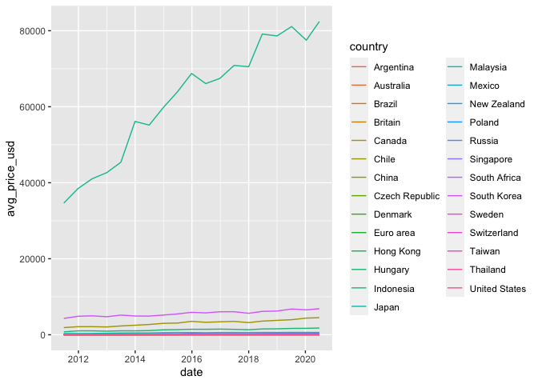<!-- -->

## Caso de Google

``` r
gps<-read_csv("../data/archive/googleplaystore.csv")
gps%>%
  head()
```

    ## # A tibble: 6 x 13
    ##   App   Category Rating Reviews Size  Installs Type  Price `Content Rating`
    ##   <chr> <chr>     <dbl>   <dbl> <chr> <chr>    <chr> <chr> <chr>           
    ## 1 Phot… ART_AND…    4.1     159 19M   10,000+  Free  0     Everyone        
    ## 2 Colo… ART_AND…    3.9     967 14M   500,000+ Free  0     Everyone        
    ## 3 U La… ART_AND…    4.7   87510 8.7M  5,000,0… Free  0     Everyone        
    ## 4 Sket… ART_AND…    4.5  215644 25M   50,000,… Free  0     Teen            
    ## 5 Pixe… ART_AND…    4.3     967 2.8M  100,000+ Free  0     Everyone        
    ## 6 Pape… ART_AND…    4.4     167 5.6M  50,000+  Free  0     Everyone        
    ## # … with 4 more variables: Genres <chr>, `Last Updated` <chr>, `Current
    ## #   Ver` <chr>, `Android Ver` <chr>

¿Cuáles son las categorías mejor calificadas?

``` r
gps%>%
  ggplot(aes(Category,Rating))+
  geom_boxplot()+
  coord_flip()
```

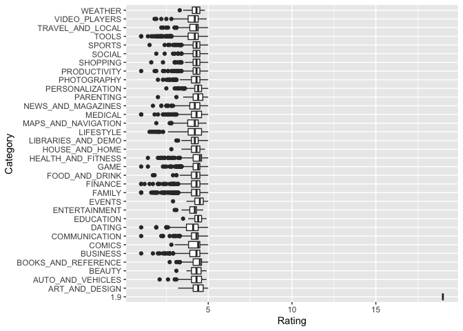<!-- -->

Hay un dato mal escrito o anomalo totalmente

``` r
gps%>%
  filter(Category!='1.9')%>%
  mutate(Category=fct_reorder(Category,Rating,sum))%>%
  ggplot(aes(Category,Rating))+
  geom_boxplot()+
  coord_flip()
```

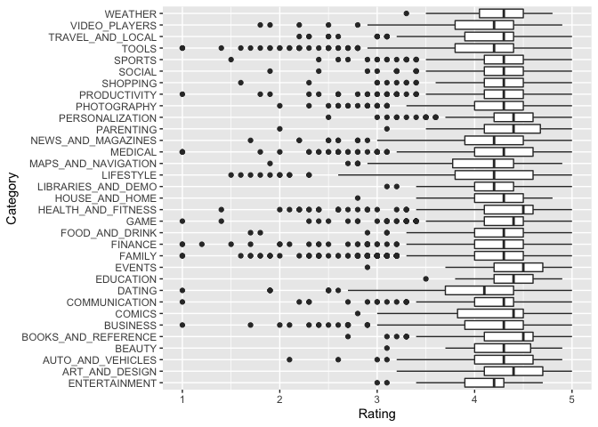<!-- -->

Se limpia la base de datos

``` r
gps%>%
  filter(Category!='1.9')->gps

gps%>%
  filter(!is.na(Rating))%>%
  group_by(Category,Type)%>%
  summarize(mean_rating=mean(Rating))%>%
  arrange(desc(mean_rating))%>%
  ungroup()%>%
  mutate(Category=fct_reorder(Category,mean_rating,sum))%>%
  ggplot(aes(mean_rating,Category,fill=Type))+
  geom_col()
```

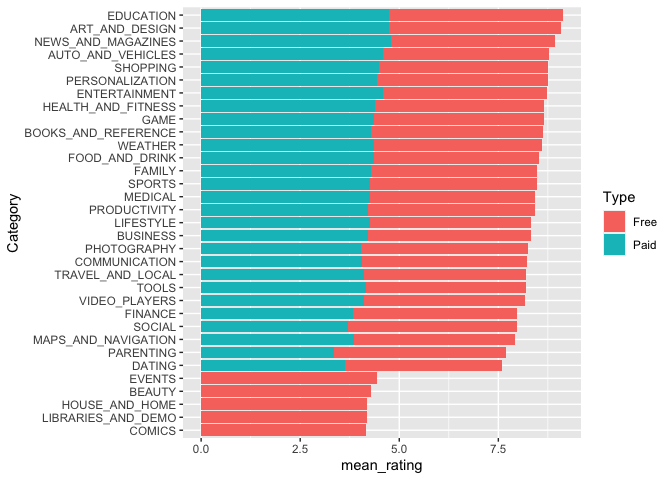<!-- -->

``` r
gps%>%
  filter(!is.na(Rating))%>%
  group_by(Category,Type)%>%
  summarize(mean_rating=mean(Rating))%>%
  arrange(desc(mean_rating))%>%
  ungroup()%>%
  mutate(Category=fct_reorder(Category,mean_rating,sum))%>%
  ggplot(aes(mean_rating,Category,fill=Type))+
  geom_col()+
  facet_wrap(~Type)
```

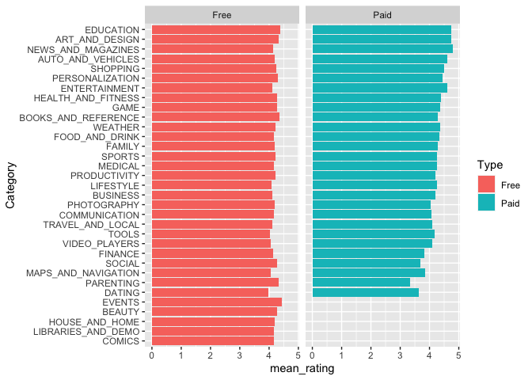<!-- -->

Quitando las 5 primeras categorías de pago ¿Hay una diferencia entre la
calificación de la app cuándo es paga?

``` r
library(infer)
gps%>%
  filter(Category %in% c("COMICS","LIBRARIES_AND_DEMO","HOUSE_AND_HOME","EVENTS"))%>%
  mutate(Category=factor(Category))%>%
  na.omit()->gps_infer

f_hat<-gps_infer%>%
  specify(Rating~Category)%>%
  calculate(stat = "F")
```

``` r
null_distn <- gps_infer%>%
  specify(Rating~Category)%>%
   hypothesize(null = "independence") %>%
   generate(reps = 1000, type = "permute") %>%
   calculate(stat = "F")
```

``` r
visualize(null_distn) +
  shade_p_value(obs_stat = f_hat, direction = "greater")
```

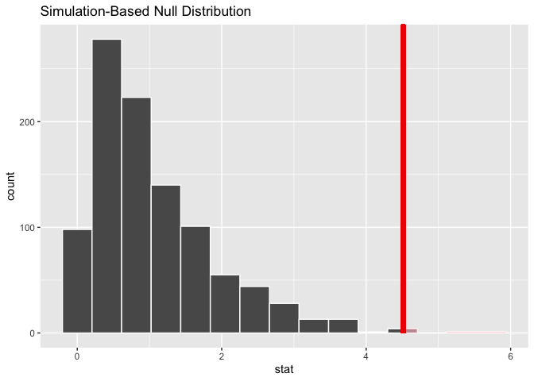<!-- -->

``` r
null_distn %>%
  get_p_value(obs_stat = f_hat, direction = "greater")
```

    ## # A tibble: 1 x 1
    ##   p_value
    ##     <dbl>
    ## 1   0.003

Los datos o grupos son no independientes y como tal se deben trabajar!!

-   No influye en la calificación si la app es paga

¿Hasta que punto se pueden comparar?

``` r
bootstrap_distribution <- gps_infer %>% 
  specify(response = Rating) %>% 
  generate(reps = 1000) %>% 
  calculate(stat = "mean")
```

``` r
visualize(bootstrap_distribution)
```

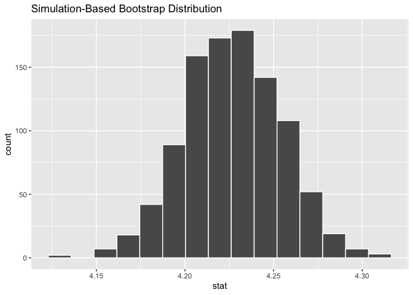<!-- -->

``` r
percentile_ci <- bootstrap_distribution %>% 
  get_confidence_interval(level = 0.95, type = "percentile")
percentile_ci
```

    ## # A tibble: 1 x 2
    ##   lower_ci upper_ci
    ##      <dbl>    <dbl>
    ## 1     4.17     4.28

``` r
visualize(bootstrap_distribution) + 
  shade_confidence_interval(endpoints = percentile_ci)
```

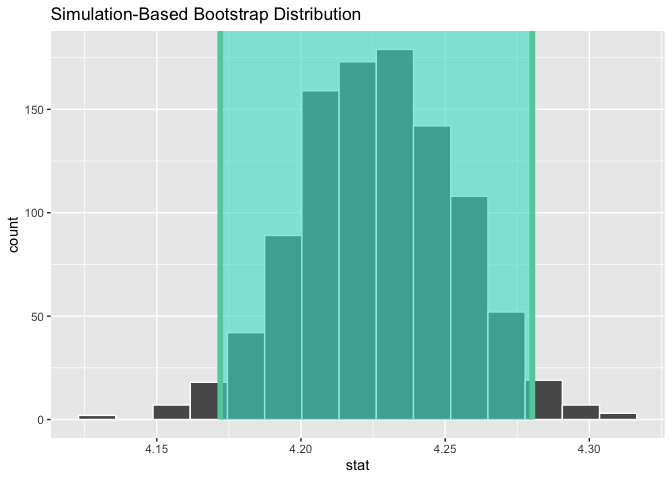<!-- -->

``` r
visualize(bootstrap_distribution) + 
  shade_ci(endpoints = percentile_ci, color = "hotpink", fill = "khaki")
```

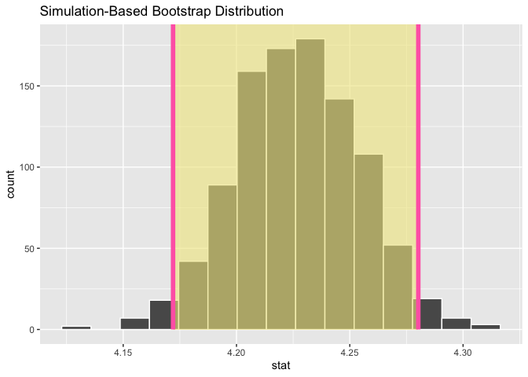<!-- -->

¿Hay alguna Evidencia sobre el Efecto de las apps pagas?

``` r
gps%>%
  filter(Type!="NaN")->Paso1

Paso1%>%
  mutate_if(is.character,as.factor)->Paso2
```

``` r
Paso1%>%
  count(Type)
```

    ## # A tibble: 2 x 2
    ##   Type      n
    ## * <chr> <int>
    ## 1 Free  10039
    ## 2 Paid    800

Exploremos un poco más, ahora con diferencia de proporciones

``` r
null_distribution_apps<-Paso2%>%
  filter(!is.na(Rating))%>%
  specify(formula = Rating ~ Type)%>%
  hypothesize(null = "independence")%>%
  generate(reps = 100, type = "permute") %>%
  calculate(stat = "diff in means", order = c("Paid", "Free"))
```

``` r
obs_diff_means <- Paso2%>%
  filter(!is.na(Rating))%>%
  specify(formula = Rating ~ Type)%>% 
  calculate(stat = "diff in means", order = c("Paid", "Free"))
obs_diff_means
```

    ## # A tibble: 1 x 1
    ##     stat
    ##    <dbl>
    ## 1 0.0804

Veamos el P-value

``` r
visualize(null_distribution_apps, bins = 10) + 
  shade_p_value(obs_stat = obs_diff_means, direction = "both")
```

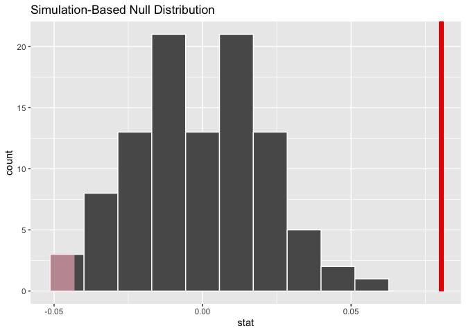<!-- -->

``` r
null_distribution_apps %>% 
  get_p_value(obs_stat = obs_diff_means, direction = "both")
```

    ## # A tibble: 1 x 1
    ##   p_value
    ##     <dbl>
    ## 1       0

SI hay diferencias entre los ratings por apps pagas

Ahora exploremos las aplicaciones dada la naturaleza de pago

``` r
null_spac <- Paso2%>%
  filter(!is.na(Rating))%>%
  specify(formula = Category ~ Type)%>% 
  hypothesize(null = "independence") %>%
  generate(reps = 100, type = "permute") %>%
  calculate(stat = "Chisq")
```

``` r
ggplot(null_spac, aes(x = stat)) +
  geom_density() +
  stat_function(
  fun = dchisq,
  args = list(df = 4),
  color = "blue"
  ) 
```

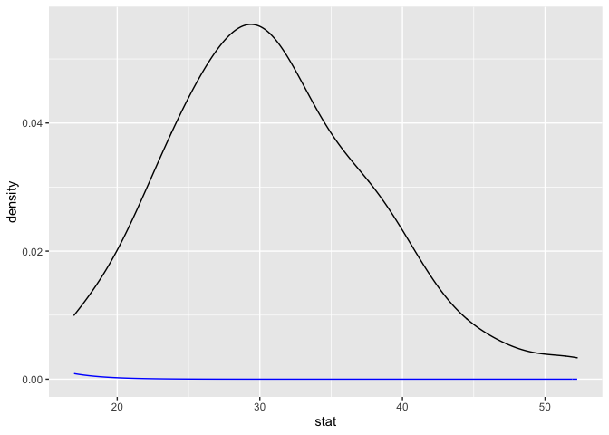<!-- -->
