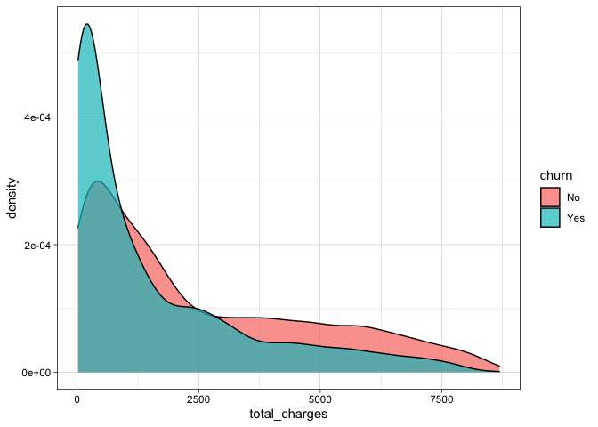

Clase de Analytics
================

## Objetivo

En esta parte de la clase vamos a introducir el concepto de Analytics
aplicado.

La base de datos que trabajaremos es :
[Telco-Churn](https://www.kaggle.com/blastchar/telco-customer-churn) y
el objetivo será predecir la fuga de clientes y ¿como afecta al
negocio?.

## Un poquito de teoría

[1]

Uno de los objetivos del analytics tiene que ver con la capacidad de
responder alguna de las siguientes preguntas rectoras:

-   ¿Hay alguna diferencia entre A y B, (Usuarios, Creatividades, etc)
-   ¿Es extraño el comportamiento de este cliente ó evento ?
-   ¿Cuánto es / Cuánto será?
-   ¿Qué se podría hacer?

## Pero ……. ¿Qué es el Analytics?

Es la sumatoria de métodos y herramientas para entender la información y
con base a ello tomar decisiones.

El analytics tiene tres componentes :

-   Componente Descriptivo:

    -   ¿Qué paso?
    -   ¿Cuanto?, ¿Donde?
    -   ¿Cuál es el problema?

-   Componente Predictivo:

    -   ¿Alertas?
    -   ¿Qué podría pasar si? (simulaciones)
    -   ¿Qué pasará ? (Pronósticos)

-   Componente Prescriptivo :

    -   ¿Cómo puedo tener un mejor resultado? (Optimización)
    -   ¿Qué otras variables debo tener presentes?

## Analytics ejercicio practico

``` r
library(tidyverse) # Paquete para manipular datos
library(janitor) # Paquete para limpiar datos 
library(cowplot) # paquete gráfico
library(GGally) # Paquete Gráfico
library(corrplot) # Paquete Gráfico
library(rlang)
library(skimr) # Mira la completitud de los datos
library(stringr)
library(MASS)
library(car)
library(InformationValue)
```

Base de datos

``` r
data <- read_csv("../data/WA_Fn-UseC_-Telco-Customer-Churn.csv")
```

``` r
data%>%
  head()
```

    ## # A tibble: 6 x 21
    ##   customerID gender SeniorCitizen Partner Dependents tenure PhoneService
    ##   <chr>      <chr>          <dbl> <chr>   <chr>       <dbl> <chr>       
    ## 1 7590-VHVEG Female             0 Yes     No              1 No          
    ## 2 5575-GNVDE Male               0 No      No             34 Yes         
    ## 3 3668-QPYBK Male               0 No      No              2 Yes         
    ## 4 7795-CFOCW Male               0 No      No             45 No          
    ## 5 9237-HQITU Female             0 No      No              2 Yes         
    ## 6 9305-CDSKC Female             0 No      No              8 Yes         
    ## # … with 14 more variables: MultipleLines <chr>, InternetService <chr>,
    ## #   OnlineSecurity <chr>, OnlineBackup <chr>, DeviceProtection <chr>,
    ## #   TechSupport <chr>, StreamingTV <chr>, StreamingMovies <chr>,
    ## #   Contract <chr>, PaperlessBilling <chr>, PaymentMethod <chr>,
    ## #   MonthlyCharges <dbl>, TotalCharges <dbl>, Churn <chr>

## Obejtivos del estudio

-   Entender que nos quieren decir los datos (EDA)

-   Construir un modelo de clasificación para predecir ¿qué usuarios
    haran churn?

\*\* ¿Qué es Churn? : Tasa de deserción

## EDA

Explorando de manera eficiente la base de datos

``` r
data%>%
  skim()
```

|                                                  |            |
|:-------------------------------------------------|:-----------|
| Name                                             | Piped data |
| Number of rows                                   | 7043       |
| Number of columns                                | 21         |
| \_\_\_\_\_\_\_\_\_\_\_\_\_\_\_\_\_\_\_\_\_\_\_   |            |
| Column type frequency:                           |            |
| character                                        | 17         |
| numeric                                          | 4          |
| \_\_\_\_\_\_\_\_\_\_\_\_\_\_\_\_\_\_\_\_\_\_\_\_ |            |
| Group variables                                  | None       |

Data summary

**Variable type: character**

| skim\_variable   | n\_missing | complete\_rate | min | max | empty | n\_unique | whitespace |
|:-----------------|-----------:|---------------:|----:|----:|------:|----------:|-----------:|
| customerID       |          0 |              1 |  10 |  10 |     0 |      7043 |          0 |
| gender           |          0 |              1 |   4 |   6 |     0 |         2 |          0 |
| Partner          |          0 |              1 |   2 |   3 |     0 |         2 |          0 |
| Dependents       |          0 |              1 |   2 |   3 |     0 |         2 |          0 |
| PhoneService     |          0 |              1 |   2 |   3 |     0 |         2 |          0 |
| MultipleLines    |          0 |              1 |   2 |  16 |     0 |         3 |          0 |
| InternetService  |          0 |              1 |   2 |  11 |     0 |         3 |          0 |
| OnlineSecurity   |          0 |              1 |   2 |  19 |     0 |         3 |          0 |
| OnlineBackup     |          0 |              1 |   2 |  19 |     0 |         3 |          0 |
| DeviceProtection |          0 |              1 |   2 |  19 |     0 |         3 |          0 |
| TechSupport      |          0 |              1 |   2 |  19 |     0 |         3 |          0 |
| StreamingTV      |          0 |              1 |   2 |  19 |     0 |         3 |          0 |
| StreamingMovies  |          0 |              1 |   2 |  19 |     0 |         3 |          0 |
| Contract         |          0 |              1 |   8 |  14 |     0 |         3 |          0 |
| PaperlessBilling |          0 |              1 |   2 |   3 |     0 |         2 |          0 |
| PaymentMethod    |          0 |              1 |  12 |  25 |     0 |         4 |          0 |
| Churn            |          0 |              1 |   2 |   3 |     0 |         2 |          0 |

**Variable type: numeric**

| skim\_variable | n\_missing | complete\_rate |    mean |      sd |    p0 |    p25 |     p50 |     p75 |    p100 | hist  |
|:---------------|-----------:|---------------:|--------:|--------:|------:|-------:|--------:|--------:|--------:|:------|
| SeniorCitizen  |          0 |              1 |    0.16 |    0.37 |  0.00 |   0.00 |    0.00 |    0.00 |    1.00 | ▇▁▁▁▂ |
| tenure         |          0 |              1 |   32.37 |   24.56 |  0.00 |   9.00 |   29.00 |   55.00 |   72.00 | ▇▃▃▃▆ |
| MonthlyCharges |          0 |              1 |   64.76 |   30.09 | 18.25 |  35.50 |   70.35 |   89.85 |  118.75 | ▇▅▆▇▅ |
| TotalCharges   |         11 |              1 | 2283.30 | 2266.77 | 18.80 | 401.45 | 1397.47 | 3794.74 | 8684.80 | ▇▂▂▂▁ |

Se ajusta la selección de variables

¿Por qué quitamos esta variable? -&gt; discusión en clase

``` r
data <- data %>%
  dplyr::select(-customerID)

data%>%
  head()
```

    ## # A tibble: 6 x 20
    ##   gender SeniorCitizen Partner Dependents tenure PhoneService MultipleLines
    ##   <chr>          <dbl> <chr>   <chr>       <dbl> <chr>        <chr>        
    ## 1 Female             0 Yes     No              1 No           No phone ser…
    ## 2 Male               0 No      No             34 Yes          No           
    ## 3 Male               0 No      No              2 Yes          No           
    ## 4 Male               0 No      No             45 No           No phone ser…
    ## 5 Female             0 No      No              2 Yes          No           
    ## 6 Female             0 No      No              8 Yes          Yes          
    ## # … with 13 more variables: InternetService <chr>, OnlineSecurity <chr>,
    ## #   OnlineBackup <chr>, DeviceProtection <chr>, TechSupport <chr>,
    ## #   StreamingTV <chr>, StreamingMovies <chr>, Contract <chr>,
    ## #   PaperlessBilling <chr>, PaymentMethod <chr>, MonthlyCharges <dbl>,
    ## #   TotalCharges <dbl>, Churn <chr>

Creamos un indicaror

``` r
data<-data %>%
  mutate(id = 1:n())

data
```

    ## # A tibble: 7,043 x 21
    ##    gender SeniorCitizen Partner Dependents tenure PhoneService MultipleLines
    ##    <chr>          <dbl> <chr>   <chr>       <dbl> <chr>        <chr>        
    ##  1 Female             0 Yes     No              1 No           No phone ser…
    ##  2 Male               0 No      No             34 Yes          No           
    ##  3 Male               0 No      No              2 Yes          No           
    ##  4 Male               0 No      No             45 No           No phone ser…
    ##  5 Female             0 No      No              2 Yes          No           
    ##  6 Female             0 No      No              8 Yes          Yes          
    ##  7 Male               0 No      Yes            22 Yes          Yes          
    ##  8 Female             0 No      No             10 No           No phone ser…
    ##  9 Female             0 Yes     No             28 Yes          Yes          
    ## 10 Male               0 No      Yes            62 Yes          No           
    ## # … with 7,033 more rows, and 14 more variables: InternetService <chr>,
    ## #   OnlineSecurity <chr>, OnlineBackup <chr>, DeviceProtection <chr>,
    ## #   TechSupport <chr>, StreamingTV <chr>, StreamingMovies <chr>,
    ## #   Contract <chr>, PaperlessBilling <chr>, PaymentMethod <chr>,
    ## #   MonthlyCharges <dbl>, TotalCharges <dbl>, Churn <chr>, id <int>

Se limpian los nombres de las variables

``` r
data<-data%>%
  clean_names()

data%>%
  head()
```

    ## # A tibble: 6 x 21
    ##   gender senior_citizen partner dependents tenure phone_service multiple_lines
    ##   <chr>           <dbl> <chr>   <chr>       <dbl> <chr>         <chr>         
    ## 1 Female              0 Yes     No              1 No            No phone serv…
    ## 2 Male                0 No      No             34 Yes           No            
    ## 3 Male                0 No      No              2 Yes           No            
    ## 4 Male                0 No      No             45 No            No phone serv…
    ## 5 Female              0 No      No              2 Yes           No            
    ## 6 Female              0 No      No              8 Yes           Yes           
    ## # … with 14 more variables: internet_service <chr>, online_security <chr>,
    ## #   online_backup <chr>, device_protection <chr>, tech_support <chr>,
    ## #   streaming_tv <chr>, streaming_movies <chr>, contract <chr>,
    ## #   paperless_billing <chr>, payment_method <chr>, monthly_charges <dbl>,
    ## #   total_charges <dbl>, churn <chr>, id <int>

Ahora si a verificar la data

``` r
data%>%
  skim()
```

|                                                  |            |
|:-------------------------------------------------|:-----------|
| Name                                             | Piped data |
| Number of rows                                   | 7043       |
| Number of columns                                | 21         |
| \_\_\_\_\_\_\_\_\_\_\_\_\_\_\_\_\_\_\_\_\_\_\_   |            |
| Column type frequency:                           |            |
| character                                        | 16         |
| numeric                                          | 5          |
| \_\_\_\_\_\_\_\_\_\_\_\_\_\_\_\_\_\_\_\_\_\_\_\_ |            |
| Group variables                                  | None       |

Data summary

**Variable type: character**

| skim\_variable     | n\_missing | complete\_rate | min | max | empty | n\_unique | whitespace |
|:-------------------|-----------:|---------------:|----:|----:|------:|----------:|-----------:|
| gender             |          0 |              1 |   4 |   6 |     0 |         2 |          0 |
| partner            |          0 |              1 |   2 |   3 |     0 |         2 |          0 |
| dependents         |          0 |              1 |   2 |   3 |     0 |         2 |          0 |
| phone\_service     |          0 |              1 |   2 |   3 |     0 |         2 |          0 |
| multiple\_lines    |          0 |              1 |   2 |  16 |     0 |         3 |          0 |
| internet\_service  |          0 |              1 |   2 |  11 |     0 |         3 |          0 |
| online\_security   |          0 |              1 |   2 |  19 |     0 |         3 |          0 |
| online\_backup     |          0 |              1 |   2 |  19 |     0 |         3 |          0 |
| device\_protection |          0 |              1 |   2 |  19 |     0 |         3 |          0 |
| tech\_support      |          0 |              1 |   2 |  19 |     0 |         3 |          0 |
| streaming\_tv      |          0 |              1 |   2 |  19 |     0 |         3 |          0 |
| streaming\_movies  |          0 |              1 |   2 |  19 |     0 |         3 |          0 |
| contract           |          0 |              1 |   8 |  14 |     0 |         3 |          0 |
| paperless\_billing |          0 |              1 |   2 |   3 |     0 |         2 |          0 |
| payment\_method    |          0 |              1 |  12 |  25 |     0 |         4 |          0 |
| churn              |          0 |              1 |   2 |   3 |     0 |         2 |          0 |

**Variable type: numeric**

| skim\_variable   | n\_missing | complete\_rate |    mean |      sd |    p0 |     p25 |     p50 |     p75 |    p100 | hist  |
|:-----------------|-----------:|---------------:|--------:|--------:|------:|--------:|--------:|--------:|--------:|:------|
| senior\_citizen  |          0 |              1 |    0.16 |    0.37 |  0.00 |    0.00 |    0.00 |    0.00 |    1.00 | ▇▁▁▁▂ |
| tenure           |          0 |              1 |   32.37 |   24.56 |  0.00 |    9.00 |   29.00 |   55.00 |   72.00 | ▇▃▃▃▆ |
| monthly\_charges |          0 |              1 |   64.76 |   30.09 | 18.25 |   35.50 |   70.35 |   89.85 |  118.75 | ▇▅▆▇▅ |
| total\_charges   |         11 |              1 | 2283.30 | 2266.77 | 18.80 |  401.45 | 1397.47 | 3794.74 | 8684.80 | ▇▂▂▂▁ |
| id               |          0 |              1 | 3522.00 | 2033.28 |  1.00 | 1761.50 | 3522.00 | 5282.50 | 7043.00 | ▇▇▇▇▇ |

Convertir en factor algunas variables

``` r
data<-data%>%
  mutate_if(is.character,as.factor)%>%
  mutate(senior_citizen = factor(senior_citizen))%>%
  filter(!is.na(total_charges))

data%>%
  head()
```

    ## # A tibble: 6 x 21
    ##   gender senior_citizen partner dependents tenure phone_service multiple_lines
    ##   <fct>  <fct>          <fct>   <fct>       <dbl> <fct>         <fct>         
    ## 1 Female 0              Yes     No              1 No            No phone serv…
    ## 2 Male   0              No      No             34 Yes           No            
    ## 3 Male   0              No      No              2 Yes           No            
    ## 4 Male   0              No      No             45 No            No phone serv…
    ## 5 Female 0              No      No              2 Yes           No            
    ## 6 Female 0              No      No              8 Yes           Yes           
    ## # … with 14 more variables: internet_service <fct>, online_security <fct>,
    ## #   online_backup <fct>, device_protection <fct>, tech_support <fct>,
    ## #   streaming_tv <fct>, streaming_movies <fct>, contract <fct>,
    ## #   paperless_billing <fct>, payment_method <fct>, monthly_charges <dbl>,
    ## #   total_charges <dbl>, churn <fct>, id <int>

## Explorando las variables númericas en presencia de valores atípicos

``` r
data%>%
  ggplot(aes(tenure, fill=gender))+
  geom_histogram()
```

<!-- -->

``` r
data%>%
  ggplot(aes(monthly_charges, fill=gender))+
  geom_histogram()
```

<!-- -->

``` r
data%>%
  ggplot(aes(total_charges, fill=gender))+
  geom_histogram()
```

<!-- -->

¿Cómo visualizar datos atípicos?

``` r
data%>%
  ggplot(aes(gender,tenure, fill=phone_service))+
  geom_boxplot()
```

<!-- -->

``` r
data%>%
  ggplot(aes(gender,monthly_charges, fill=gender))+
  geom_boxplot()
```

<!-- -->

``` r
#total_charges
data%>%
  ggplot(aes(payment_method,total_charges, fill=gender))+
  geom_boxplot()+
  coord_flip()
```

<!-- -->

## Evaluando el churn

``` r
data%>%
  group_by(churn)%>%
  summarize(n=n())%>%
  mutate(pct=n/sum(n))
```

    ## # A tibble: 2 x 3
    ##   churn     n   pct
    ## * <fct> <int> <dbl>
    ## 1 No     5163 0.734
    ## 2 Yes    1869 0.266

Buscando una razón para el churn

``` r
theme_set(theme_linedraw())
data%>%
  ggplot(aes(tenure,fill=churn))+
  geom_bar(alpha=0.7)
```

<!-- -->

Tu tarea es colocarle el valor dentro de las barritas una pista
**geom\_text**

``` r
data %>% 
  ggplot(mapping = aes(x = tenure)) +
  geom_bar(aes(fill = churn),position = 'fill',color="black",alpha=0.7) +
  scale_y_continuous(labels = scales::percent_format())
```

<!-- -->

``` r
data %>% 
  ggplot(aes(x =total_charges,fill = churn)) + 
  geom_density(alpha=0.7,color="black")
```

<!-- -->

Y si lo evaluamos por una correlación de toda la vida

``` r
data%>%
  select_if(is.numeric)%>%
  dplyr::select(-id)%>%
  cor()%>%
  corrplot()
```

<!-- -->

``` r
library(GGally)
data%>%
  select_if(is.numeric)%>%
  dplyr::select(-id)
```

    ## # A tibble: 7,032 x 3
    ##    tenure monthly_charges total_charges
    ##     <dbl>           <dbl>         <dbl>
    ##  1      1            29.8          29.8
    ##  2     34            57.0        1890. 
    ##  3      2            53.8         108. 
    ##  4     45            42.3        1841. 
    ##  5      2            70.7         152. 
    ##  6      8            99.6         820. 
    ##  7     22            89.1        1949. 
    ##  8     10            29.8         302. 
    ##  9     28           105.         3046. 
    ## 10     62            56.2        3488. 
    ## # … with 7,022 more rows

``` r
data%>%
  dplyr::select(churn,tenure,monthly_charges,total_charges)%>%
  ggpairs(aes(color=churn))
```

<!-- -->

``` r
sam <- theme(plot.background = element_rect(fill="#F5FFFA",color = "darkblue"),
             plot.title = element_text(size=25, hjust=.5),
             axis.title.x = element_text(size=25, color = "black"),
              axis.title.y = element_text(size=25, color = "black"),
             axis.text.x = element_text(size=20),
             axis.text.y = element_text(size=20),
            legend.position = "top",
            legend.text = element_text(size=20),
            legend.title = element_text(size=20))

plot_categorical_vs_target <- function(data, target, list_of_variables){
    target <- sym(target) #Converting the string to a column reference
    i <-1 
    plt_matrix <- list()
    for(column in list_of_variables){
        col <- sym(column) 
        temp <- data %>% group_by(!!sym(col),!!sym(target)) %>% 
           summarize(count = n()) %>% 
           mutate(prop = round(count/sum(count),2)) %>%
           ungroup()%>%
           mutate(label_text = str_glue("n : {count}\nprop:{scales::percent(prop)}"))
        
        
        options(repr.plot.width=20, repr.plot.height=15) 
        
           plt_matrix[[i]]<-ggplot(data= temp, aes(x=!!sym(col), y=prop,fill =!!sym(target))) + 
             geom_bar(stat="identity",alpha=0.7,color = "black") +
             geom_label(aes(label=label_text),size = 8, hjust = 0.5, fill = "white",color="black") +
             scale_y_continuous(labels=scales::percent_format()) +
             xlab(column) +
             ylab("Prop") +
             ggtitle(paste("Distribution of 'churn'\nfrequency across",column)) +
             theme_minimal()+
        theme(axis.text.x = element_text(angle=10))+
             sam
           i<-i+1
    }
                
    plot_grid(plotlist = plt_matrix,ncol=2)
}
```

``` r
plot_categorical_vs_target(data,'churn',c('gender','senior_citizen','partner','dependents'))
```

<!-- -->
\#\# Creando un modelito

``` r
data<-data%>%
  na.omit()
library(tidymodels)
set.seed(42)
tidy_split <- initial_split(data, prop = .8, strata = churn)
tidy_train <- training(tidy_split)
tidy_test <- testing(tidy_split)
tidy_k_folds <- vfold_cv(tidy_train)
```

``` r
tidy_rec <- recipe(churn~., data = tidy_train) %>% 
  step_BoxCox(all_numeric(), -all_outcomes()) %>% 
  step_normalize(all_numeric(), -all_outcomes()) %>% 
  step_dummy(all_nominal(), -all_outcomes(), one_hot = TRUE) %>% 
  step_downsample(churn)
xgboost_model <- boost_tree(trees = tune(), tree_depth = tune()) %>% 
  set_mode("classification") %>% 
  set_engine("xgboost")
xgboost_grid <- grid_regular(parameters(xgboost_model), levels = 5, filter = c(trees > 1))
model_metrics <- metric_set(roc_auc, accuracy, mn_log_loss)
```

``` r
xgboost_tune <- tune_grid(
  xgboost_model,
  tidy_rec,
  grid = xgboost_grid,
  resamples = tidy_k_folds,
  metrics = model_metrics
)
```

``` r
xgboost_tune %>% 
  autoplot()
```

<!-- -->

``` r
xgboost_tune %>% show_best("accuracy")%>%
  arrange(desc(mean))
```

    ## # A tibble: 5 x 8
    ##   trees tree_depth .metric  .estimator  mean     n std_err .config              
    ##   <int>      <int> <chr>    <chr>      <dbl> <int>   <dbl> <chr>                
    ## 1   500          1 accuracy binary     0.747    10 0.00491 Preprocessor1_Model01
    ## 2  1000          1 accuracy binary     0.743    10 0.00491 Preprocessor1_Model02
    ## 3  1500          1 accuracy binary     0.743    10 0.00478 Preprocessor1_Model03
    ## 4  2000          1 accuracy binary     0.742    10 0.00431 Preprocessor1_Model04
    ## 5   500          8 accuracy binary     0.726    10 0.00582 Preprocessor1_Model09

xgboost\_tune %&gt;% show\_best(“accuracy”)%&gt;% arrange(desc(mean))

``` r
final_model <- workflow() %>% 
  add_model(xgboost_model) %>% 
  add_recipe(tidy_rec) %>% 
  finalize_workflow(xgboost_tune %>% show_best("accuracy", n = 1))
```

``` r
eval_df <- last_fit(final_model, tidy_split)
```

``` r
eval_df %>% 
  collect_metrics()
```

    ## # A tibble: 2 x 4
    ##   .metric  .estimator .estimate .config             
    ##   <chr>    <chr>          <dbl> <chr>               
    ## 1 accuracy binary         0.747 Preprocessor1_Model1
    ## 2 roc_auc  binary         0.846 Preprocessor1_Model1

``` r
eval_df %>% 
  collect_predictions() %>% 
  conf_mat(truth = churn, estimate = .pred_class)
```

    ##           Truth
    ## Prediction  No Yes
    ##        No  746  69
    ##        Yes 286 304

Ahora a evaluar los factores de Churn

``` r
glm_spec <- logistic_reg() %>%
  set_engine("glm")
churn_wf <- workflow() %>%
  add_formula(churn ~ .)

glm_rs <- churn_wf %>%
  add_model(glm_spec) %>%
  fit_resamples(
    resamples = tidy_k_folds,
    control = control_resamples(save_pred = TRUE)
  )

collect_metrics(glm_rs)
```

    ## # A tibble: 2 x 6
    ##   .metric  .estimator  mean     n std_err .config             
    ##   <chr>    <chr>      <dbl> <int>   <dbl> <chr>               
    ## 1 accuracy binary     0.800    10 0.00264 Preprocessor1_Model1
    ## 2 roc_auc  binary     0.842    10 0.00366 Preprocessor1_Model1

``` r
glm_rs%>%
  conf_mat_resampled()
```

    ## # A tibble: 4 x 3
    ##   Prediction Truth  Freq
    ##   <fct>      <fct> <dbl>
    ## 1 No         No    370. 
    ## 2 No         Yes    69.1
    ## 3 Yes        No     43.3
    ## 4 Yes        Yes    80.5

``` r
collect_metrics(glm_rs)
```

    ## # A tibble: 2 x 6
    ##   .metric  .estimator  mean     n std_err .config             
    ##   <chr>    <chr>      <dbl> <int>   <dbl> <chr>               
    ## 1 accuracy binary     0.800    10 0.00264 Preprocessor1_Model1
    ## 2 roc_auc  binary     0.842    10 0.00366 Preprocessor1_Model1

``` r
members_final <- churn_wf %>%
  add_model(glm_spec) %>%
  last_fit(tidy_split)


collect_metrics(members_final)
```

    ## # A tibble: 2 x 4
    ##   .metric  .estimator .estimate .config             
    ##   <chr>    <chr>          <dbl> <chr>               
    ## 1 accuracy binary         0.817 Preprocessor1_Model1
    ## 2 roc_auc  binary         0.857 Preprocessor1_Model1

``` r
collect_predictions(members_final) %>%
  conf_mat(churn, .pred_class)
```

    ##           Truth
    ## Prediction  No Yes
    ##        No  934 159
    ##        Yes  98 214

``` r
library(knitr)
members_final %>%
  pull(.workflow) %>%
  pluck(1) %>%
  tidy(exponentiate = TRUE) %>%
  arrange(estimate) %>%
  kable(digits = 3)
```

| term                                    | estimate | std.error | statistic | p.value |
|:----------------------------------------|---------:|----------:|----------:|--------:|
| internet\_serviceNo                     |    0.130 |     0.903 |    -2.264 |   0.024 |
| `contractTwo year`                      |    0.263 |     0.196 |    -6.816 |   0.000 |
| `contractOne year`                      |    0.562 |     0.119 |    -4.835 |   0.000 |
| dependentsYes                           |    0.817 |     0.100 |    -2.021 |   0.043 |
| tech\_supportYes                        |    0.863 |     0.202 |    -0.729 |   0.466 |
| online\_securityYes                     |    0.912 |     0.199 |    -0.462 |   0.644 |
| tenure                                  |    0.940 |     0.007 |    -8.801 |   0.000 |
| `payment_methodMailed check`            |    0.940 |     0.128 |    -0.481 |   0.631 |
| monthly\_charges                        |    0.951 |     0.035 |    -1.415 |   0.157 |
| `payment_methodCredit card (automatic)` |    0.961 |     0.127 |    -0.316 |   0.752 |
| genderMale                              |    0.980 |     0.072 |    -0.283 |   0.777 |
| id                                      |    1.000 |     0.000 |     1.276 |   0.202 |
| total\_charges                          |    1.000 |     0.000 |     4.216 |   0.000 |
| partnerYes                              |    1.002 |     0.087 |     0.018 |   0.986 |
| online\_backupYes                       |    1.113 |     0.195 |     0.548 |   0.584 |
| device\_protectionYes                   |    1.184 |     0.197 |     0.858 |   0.391 |
| senior\_citizen1                        |    1.223 |     0.095 |     2.117 |   0.034 |
| paperless\_billingYes                   |    1.342 |     0.083 |     3.535 |   0.000 |
| `payment_methodElectronic check`        |    1.348 |     0.105 |     2.853 |   0.004 |
| phone\_serviceYes                       |    1.600 |     0.725 |     0.648 |   0.517 |
| multiple\_linesYes                      |    1.649 |     0.199 |     2.517 |   0.012 |
| streaming\_moviesYes                    |    2.018 |     0.365 |     1.921 |   0.055 |
| streaming\_tvYes                        |    2.028 |     0.364 |     1.944 |   0.052 |
| (Intercept)                             |    3.561 |     0.915 |     1.389 |   0.165 |
| `internet_serviceFiber optic`           |    7.336 |     0.892 |     2.235 |   0.025 |
| `multiple_linesNo phone service`        |       NA |        NA |        NA |      NA |
| `online_securityNo internet service`    |       NA |        NA |        NA |      NA |
| `online_backupNo internet service`      |       NA |        NA |        NA |      NA |
| `device_protectionNo internet service`  |       NA |        NA |        NA |      NA |
| `tech_supportNo internet service`       |       NA |        NA |        NA |      NA |
| `streaming_tvNo internet service`       |       NA |        NA |        NA |      NA |
| `streaming_moviesNo internet service`   |       NA |        NA |        NA |      NA |

``` r
members_final %>%
  pull(.workflow) %>%
  pluck(1) %>%
  tidy() %>%
  filter(term != "(Intercept)",
         !is.na(estimate)) %>%
  ggplot(aes(estimate, fct_reorder(term, estimate))) +
  geom_vline(xintercept = 0, color = "gray50", lty = 2, size = 1.2) +
  geom_errorbar(aes(
    xmin = estimate - std.error,
    xmax = estimate + std.error
  ),
  width = .2, color = "gray50", alpha = 0.7
  ) +
  geom_point(size = 2, color = "#85144B") +
  labs(y = NULL, x = "Razones a través del coeficiente de regresión")
```

<!-- --> \*
Las razones por la que los usuarios se quedan son los rangos positivos
\* Las razones por las que no se quedan es por los rangos negativos.

[1] 1
